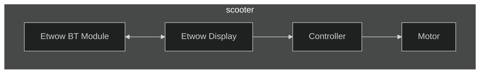
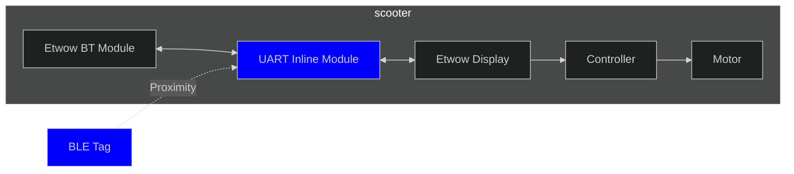

# Etwow GT Auto-lock System

A non-destructive auto-lock system for Etwow GT electric scooters that provides automatic locking/unlocking based on BLE proximity detection.

[](LICENSE)
[](firmware/controller/include/config.h)
[](docs/bom.md)

## 🎯 Overview


### Before this project





### After this project




Using the ETWOW uart command codes from  https://github.com/simonrey1/etwowconnect2/tree/main. Huge thanks !


This project implements an **inline auto-lock system** that:
- **Automatically unlocks** the scooter when you approach (no manual interaction required)
- **Automatically locks** the scooter when you walk away
- **Works without apps** - completely autonomous operation
- **Non-destructive installation** - plugs inline between existing components

## 🔧 How It Works

The system consists of two main components:

### 1. ESP32 Controller (`firmware/etwow.ino`)
- Acts as a **BLE central** device, scanning for your badge
- Intercepts UART communication between the scooter's display and Bluetooth module
- Sends `LOCK`/`UNLOCK` commands based on proximity detection
- Uses RSSI (signal strength) to determine distance with hysteresis to prevent rapid toggling
- Modular architecture with separate managers for BLE, UART, and proximity logic

### 2. BLE Badge (`firmware/badge.ino`)
- Small nRF52-based device that continuously advertises its presence
- Battery-powered (CR2032) with 1+ year autonomy
- Carried by the user (keychain, pocket, etc.)


## 🛠️ Hardware Requirements

See [docs/bom.md](docs/bom.md) for the complete bill of materials. Key components:

- **ESP32-S3** development board (BLE central, dual UART)
- **nRF52810/nRF52811** module for BLE badge
- **CR2032** battery and holder for badge
- **DC-DC buck converter** for power from scooter battery
- **JST-PH inline adapters** for non-destructive UART connection
- **Tri-state buffer** to prevent UART bus collisions

## 🚀 Quick Start

### 1. Setup Development Environment
```bash
# Clone the repository
git clone <repository-url>
cd etwow-utils

# Run the setup script
./scripts/setup.sh
```

### 2. Configure the System
```bash
# Copy environment template
cp .env.example .env

# Edit configuration
nano firmware/controller/include/config.h
# Update TARGET_BADGE_MAC with your badge's MAC address
```

### 3. Build and Flash Firmware (simple)
```bash
# Build both controller and badge (simple)
./scripts/build.sh

# Or build individually
./scripts/build.sh --controller-only
./scripts/build.sh --badge-only

# Upload to devices (specify correct ports)
./scripts/build.sh --upload --port /dev/ttyUSB0
./scripts/build.sh --badge-only --upload --port /dev/ttyACM0
```

### 4. Test the System
```bash
# Run validation tests
./scripts/test.sh

# Test individual components with examples
# See firmware/examples/ for testing tools
```

For detailed setup instructions, see [docs/quick-start.md](docs/quick-start.md).

## ⚙️ Configuration

### RSSI Thresholds (Default)
- **Unlock**: RSSI > -60 dBm (close proximity)
- **Lock**: RSSI < -80 dBm (far away)
- **Hysteresis**: 5 dBm prevents rapid toggling

### Pin Configuration
Edit `firmware/controller/include/pins.h` to match your hardware:
- UART pins for bus communication
- Output enable pin for tri-state buffer
- Hall sensor pins (if using)
- LED indicator pin

## 🧪 Testing & Development

The project includes comprehensive testing tools:

### Automated Testing
```bash
# Run full test suite
./scripts/test.sh

# Validate project structure
./scripts/validate.sh
```

### Development Examples
Examples have been removed for the simple layout. Use the simple sketches directly.

### Manual Testing
- Use examples to test individual components
- Monitor serial output for debugging
- Test with BLE scanner apps (nRF Connect)

## 🔒 Safety Features

- **Non-destructive installation** - no permanent modifications to scooter
- **Tri-state buffer** prevents UART bus collisions
- **Hysteresis logic** prevents rapid lock/unlock cycles
- **Fail-safe design** - system fails to unlocked state if controller fails
- **Emergency timeout** - automatic lock after extended unlock period

## 🔋 Power Management

- **ESP32**: Powered from scooter battery via efficient buck converter
- **Badge**: CR2032 battery with 1+ year autonomy
- **Low-power modes** implemented for extended battery life
- **Battery monitoring** with low-battery warnings

## 📋 Installation Checklist

- [ ] Run setup script and install dependencies
- [ ] Configure MAC address in config.h
- [ ] Flash BLE badge firmware and note MAC address
- [ ] Flash ESP32 controller firmware
- [ ] Test BLE scanning with example code
- [ ] Test UART monitoring with example code
- [ ] Install hardware inline between display and BT module
- [ ] Connect power from scooter battery
- [ ] Test lock/unlock functionality
- [ ] Mount in waterproof enclosure
- [ ] Run validation tests

## 🐛 Troubleshooting

### Badge not detected
- Check MAC address configuration in config.h
- Verify badge is powered and advertising
- Check battery level (should show in Serial Monitor)
- Test with BLE scanner app (nRF Connect)

### UART communication issues
- Verify inline connection with JST-PH adapters
- Check baud rate (115200) and pin assignments
- Test with UART monitoring example
- Ensure tri-state buffer is working properly

### Power issues
- Check buck converter output voltage (5V)
- Verify power connections and fusing
- Test with USB power first
- Check for short circuits

### Build issues
- Run setup script to install dependencies
- Check Arduino CLI installation
- Verify board support packages are installed

## 📄 License

This project is open source. See LICENSE file for details.

## 🤝 Contributing

Contributions welcome! Please:
1. Fork the repository
2. Create a feature branch
3. Make your changes
4. Run tests: `./scripts/test.sh`
5. Submit a pull request

## 📚 Documentation

Key docs in `docs/`:
- [Quick Start Guide](docs/quick-start.md)
- [Bill of Materials](docs/bom.md)

## ⚠️ Disclaimer

This is a DIY project. Use at your own risk. Always follow local laws and regulations regarding electric scooter modifications. The authors are not responsible for any damage or injury resulting from the use of this system.
